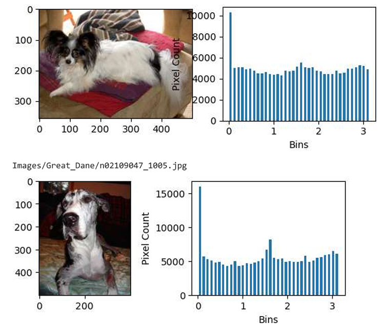
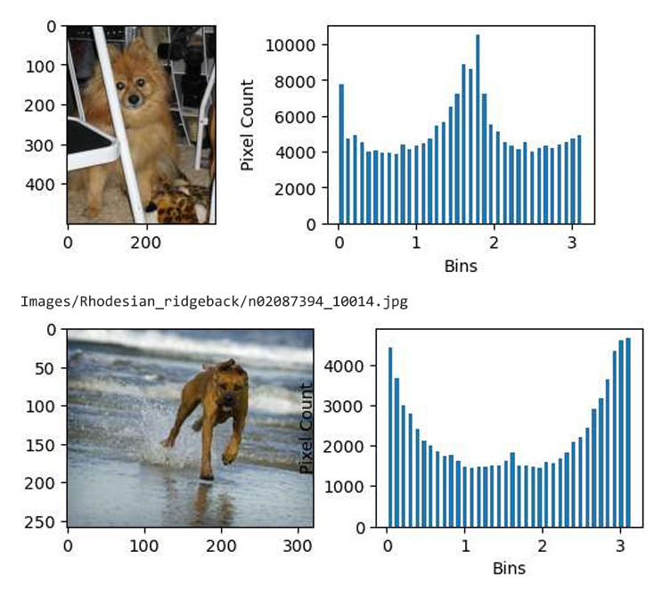
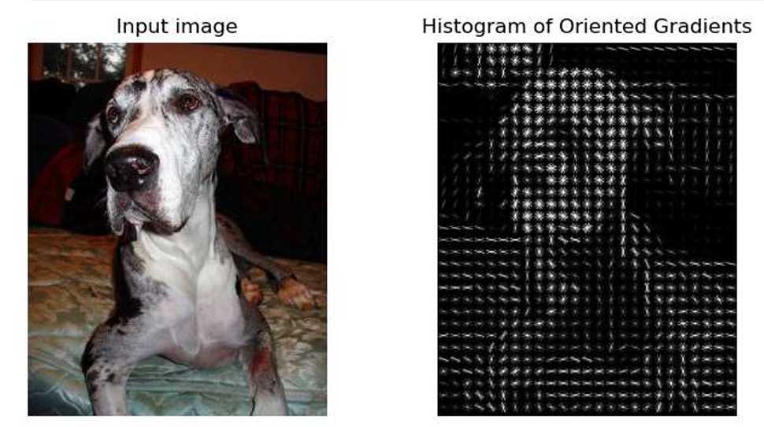
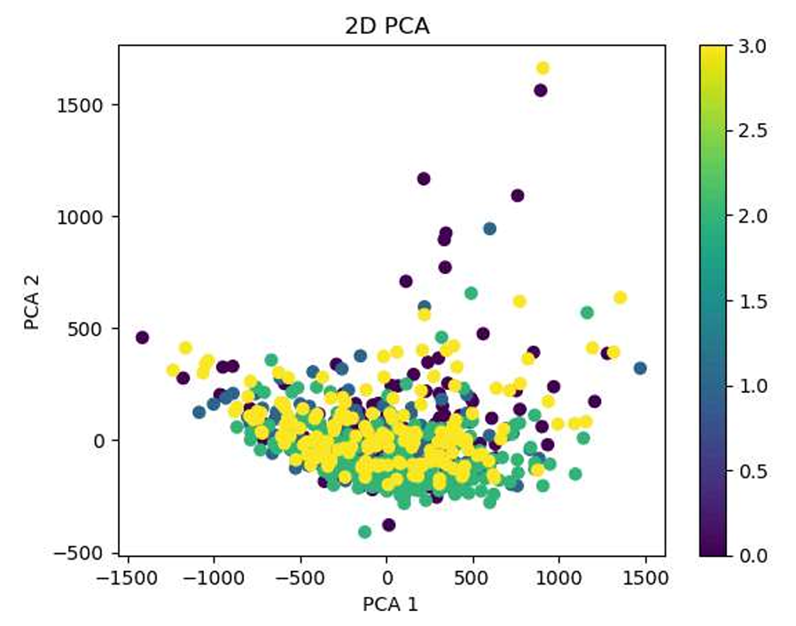
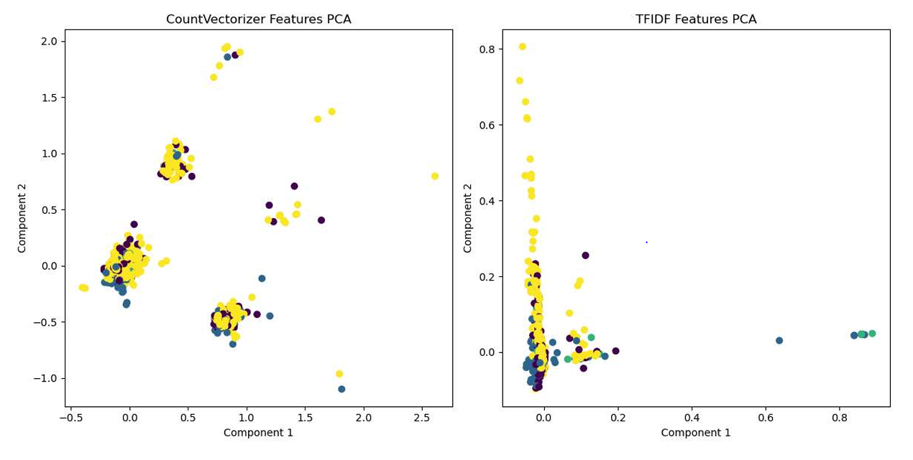

# DataMining Assignment1

Programming Assignment1- Data Preparation and Understanding
1. In this semester, we will be using the “Stanford Dogs” dataset (http://vision.stanford.edu/
 aditya86/ImageNetDogs/) for all our 4 programming assignments. There are a total of 120 classes
 (dog breeds). The number of images for each class ranges from 148 to 252.
 Each student will
 (a) be assigned 4 classes to work on the 4 assignments.
 (b) download Images (and also Annotations- bounding boxes) datasets for the 4 classes to work on.
 (c) create a Github accounttoshare (as collaborator) their solution (Readme, Codes, Processed Dataset
 for Code to run correctly) with the grader

 Assigned classes for me:
n02086910_10147---paillion 
n02109047_1005---Great_Dane n02109047_1005
n02112018_10129---Pomeranian n02112018_10129
n02087394_10014---Rhodesian Ridgeback n02087394_10014

  2. UseXMLprocessingmodules(https://docs.python.org/3/library/xml.html)toobtainbound
ingboxinformationfromAnnotationsdatasetsandscikit-Image(Reference: https://scikit-image.
 org/) to perform image processing and feature extraction.
 (a) CroppingandResizeImagesinYour4-classImagesDataset: Usetheboundingboxinformation
 in theAnnotationsdatasetrelevanttoyour4-classImagesDatasettocroptheimagesinyourdataset
 and then resize each image to a 128×128pixel image. (Hint: https://www.kaggle.com/code/
 espriella/stanford-dogs-transfer-crop-stack/notebook

 (b) Feature Extraction: Edge histogram AND Similarity Measurements
    i. Choose 1 image from each class.
    ii. Convert the color images to grayscale images (see https://scikit-image.org/docs/
        stable/auto_examples/color_exposure/plot_rgb_to_gray.html)
    iii. For each image 𝐼, use the following
    iv. Useskimage.exposure.histogram(seehttps://scikit-image.org/docs/stable/api/skimage.exposure.html#skimage.exposure.histogram)toobtainahistogramwith36bins.
    v. Plot the images with their corresponding edge histogram values (add x-axis label “Bins” and
        y-axis label “Pixel Count” ). (2 points)

 
 

    . Pick 2 edge histograms from the 4 you have constructed (These are the vector representations
        of the images)
    • Perform histogram comparison between the 2 edge histograms using the following met
        rics/measures. (seehttps://scikit-learn.org/stable/modules/generated/sklearn.
        metrics.pairwise.distance_metrics.html#sklearn.metrics.pairwise.distance_
        metrics)– 
        Euclidean distance– 23344.
        Manhattan distance– 7115.52303067
        Cosine distance- 0.01206799
        
   c. Histogram of Oriented Gradient (HOG) feature descriptor (see https://en.wikipedia.
        org/wiki/Histogram_of_oriented_gradients)
    i. Pick 1 image and compute its HOG descriptors. Visualise the image and the HOG descriptors
        fortheimage(seehttps://scikit-image.org/docs/stable/auto_examples/features_
        detection/plot_hog.html#sphx-glr-auto-examples-features-detection-plot-hog-py)
        (1 point)  

         

    ii. Dimensionalityreduction(usingPrincipalComponentAnalysis,PCA)(seehttps://scikit-learn.
        org/stable/modules/generated/sklearn.decomposition.PCA.htmlforPCA.https://
        scikit-learn.org/stable/auto_examples/decomposition/plot_pca_iris.htmlforcode
        example. We will use scikit learn more extensively in the next assignment)

            i. Use images from all four classes.
            ii. Convert all the images from the four classes to edge histograms.(0.5 points)
            iii. Perform Principal Component Analysis (PCA) dimensionality reduction on the set of his
                tograms to reduce from 36 to 2 dimensions. (Note: You should not use the class labels) (1
                point)
            iv. Plot the 2D points using four different colors for data from the four classes (see Figure 1).
                Howmany classes are visually separable (i.e., non-overlapping) ? (1 point)
            

 

 3.Next, we perform some text processing steps on a tweet (i.e., text) dataset. The dataset file is in json
 format and each dataset consists of
 • Training Set: 3,000 records
 • Test Set: 1,500 records
 • Validation Set: 400 records
 This is a multi-class dataset with eleven classes (‘anger’, ‘anticipation’, ‘disgust’, ‘fear’, ‘joy’, ‘love’,
 ‘optimism’, ‘pessimism’, ‘sadness’, ‘surprise’, ‘trust’).
 You will use this dataset again in Assignment 3. For this assignment, you will just be using the
 training set.
 Each student is
 (a) assigned a unique dataset, and
 (b) youneedtodownloadyourdatasetfrom https://drive.google.com/drive/folders/1v6ckoWUqFzj23JI74XzMPDCGC_
 we7TEe (Note: you need to use your Rowan email to login to the google drive)

4. You will use the simple countvectorizer and tfidfvectorizer in https://scikit-learn.org/
 stable/api/sklearn.feature_extraction.html#module-sklearn.feature_extraction.text
 to extract (1) token (feature) counts, and (2) TF-IDF feature (counts), respectively. (You will use the
 default parameters.) What are the dimensionality of the two vector representations?

CountVectorizer Dimensionality: (3000,9259)
TfidfVectorizer Dimensionality: (3000,9259)

 5. Using the two sets of processed text data in Item 4,
 • Pick four classes which you think will be separable. State the four classes.
 Anger, fear,love, surprise
 • Perform dimensionality reduction similar to 2(d) with dimensionality reduced to 2.
 • Plot the 2D points using four different colors for data from the four classes (see Figure 1) for both
    token count features and tf-idf features in two separate plots. (2 points)
 • Howmanyclasses are visually separable (i.e., non-overlapping) for both plots? (0.5 point)

